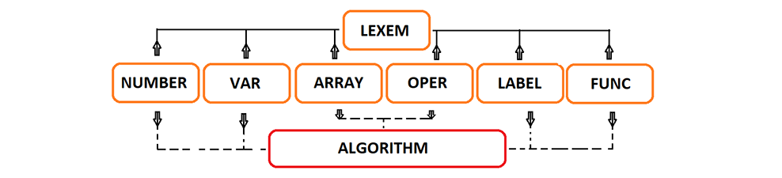

# valeron
My language: python + pascal + c++ = python4  
   
##### What it's include:  
1) Simple operations  
2) Variable  
3) Arrays  
4) Goto/Label constructions  
5) If/Else constructions  
6) circles While
7) Function
8) Correct checker  
9) Function   



##### How to compile in terminal:    
&nbsp;&nbsp;<code>make</code>  

##### How to run:   
<code>./bin/main</code>  
debug mode:  
<code>./bin/main -d</code>  
##### Syntax:
<strong>x = 1</strong> - create varable and put here 1  
<strong>y = z + x * 1</strong> - crete 2 variable: z with 0 value and y with 1 value  
<strong>x\[5\] = 6</strong> - create array \[0, 0, 0, 0, 0, 6\]  
<strong>Numerical operations:</strong>  
= + - * / % >> << ^ == != >= <= > < & |  
<strong>print x</strong> - print value  
<strong>newline</strong> - print \'\n\'  
<strong>A:</strong> - create label  
<strong>goto A</strong> - jump on label  
<strong>if/else construction:</strong>  
if x == 1 {  
&nbsp;print 1  
}  
else {  
&nbsp;print 0  
}  
<strong>while construction:</strong>  
while x < 5 {  
&nbsp;print x  
&nbsp;x = x + 1  
}  
<strong>function construction:</strong>  
def f(a)   
&nbsp;...  
endef  
  
def g(x, y, z)    
&nbsp;...  
&nbsp;return value  
endef  

### Addition:   
In \"tmp\" folder locate complited code and full example.  

## Example of program:
```
def F(x)  
  if x <= 1 {  
    return x  
  }  
  return F(x - 1) + F(x - 2)  
endef  

def g(i)  
  return i * 2  
endef

def f(x, size)  
  i = 0  
  while i < size {  
    print x[i] + g(i)  
    i = i + 1  
  }  
endef

i = 0  
while i < 5 {  
  a[i] = i  
  i = i + 1  
}  
f(a[4], 5)  
newline  
j = 1  
while j <= 10 {  
  if j % 2 == 0 {  
    print j * 2  
  }  
  else {  
    print j * 3  
  }  
  j = j + 1  
}  
newline  
i = 0  
while i <= 5 {  
  print F(i)  
  i = i + 1  
}  
newline  
x = y = z = 100  
print x * y   
```
## OUTPUT:  
#### result:  
```
0 3 6 9 12  
3 4 9 8 15 12 21 16 27 20  
0 1 1 2 3 5 
1000000  
```
#### postfix:  
```
F( x )  
x 1<=if{  
x return   
}  
x 1-F( )x 2-F( )+return  
endef  
g( i )  
i 2*return   
endef  
f( x size )  
i 0=  
$while0:i size <while {  
xi [i g( )+print   
i i 1+=  
}goto $while0  
endef  
i 0=  
$while1:i 5<while {  
ai [i =  
i i 1+=  
}goto $while1  
a4[5f( )  
newline  
j 1=  
$while2:j 10<=while {  
j 2%0==if{   
j 2*print   
}  
else{  
j 3*print   
}  
j j 1+=  
}goto $while2  
newline   
i 0=  
$while3:i 5<=while {  
i F( )print   
i i 1+=  
}goto $while3   
newline   
x y z 100===  
x y *z *print   
```
#### variable:  
```
i=6  
j=11  
x=100  
y=100  
z=100  
```
#### array:
```
a[ 0 1 2 3 4 ]  
```
#### label:    
```
$while0  
$while1  
$while2  
$while3  
```
#### function:  
```
F( x )  
f( x size )  
g( i )  
```
